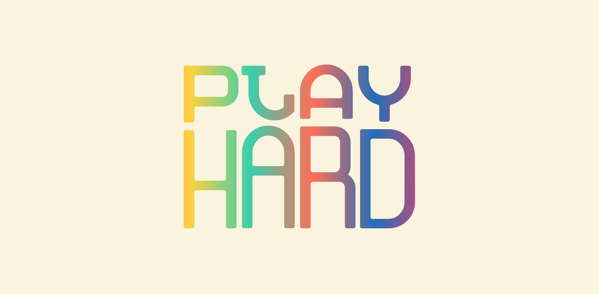
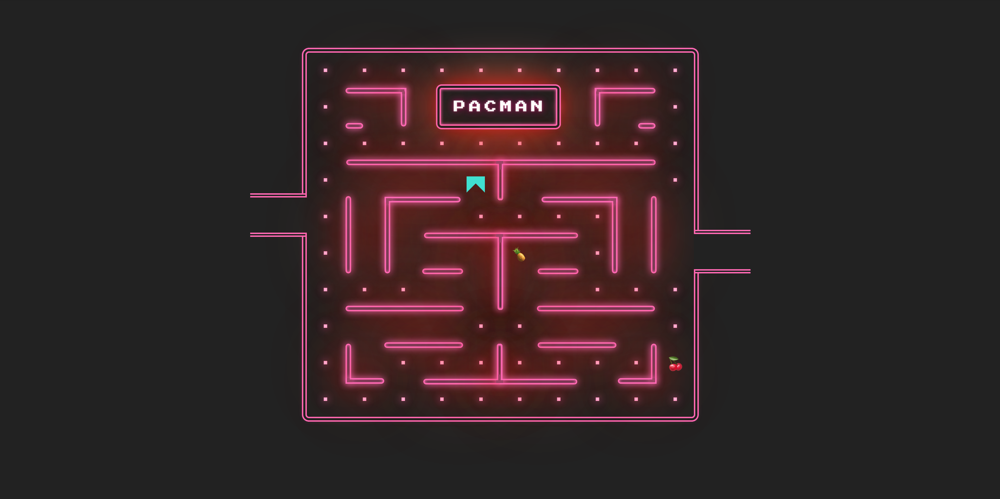
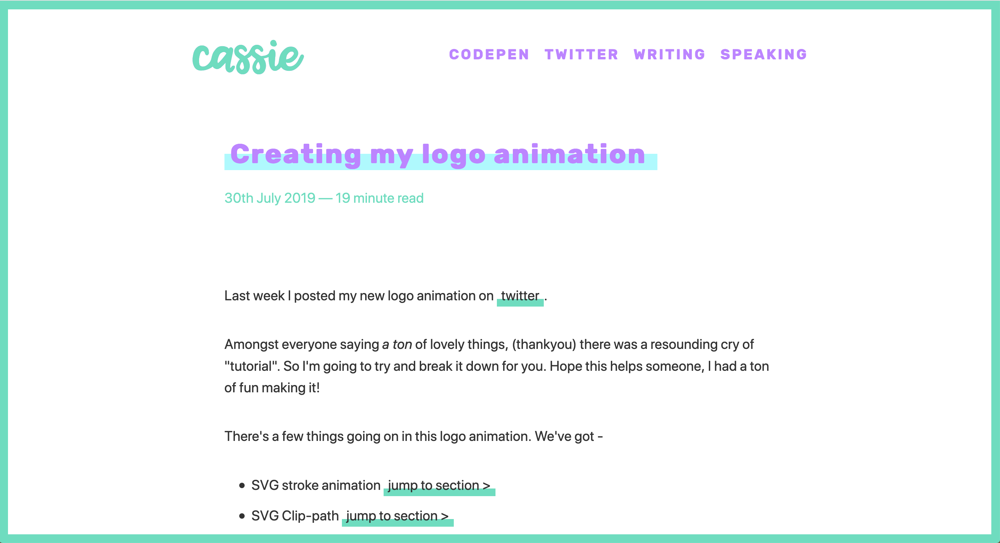
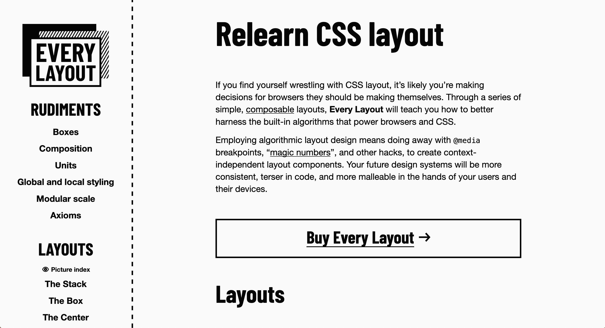

The web today feels quite polarised. Web standards advocates seem to be at perpetual loggerheads with framework developers, and new arguments erupt on Twitter almost daily. But plugging away amongst all the noise are many, many incredibly talented developers, simply building wonderful things that make my heart soar. There are so many people sharing demos, articles and talks that provide a dopamine hit of inspiration and blow away any grey clouds.

I’d like to share some of the things that have been inspiring me, in what I hope will be a semi-regular collection here on the blog. I hope they’ll inspire you too!

## Demos

### [Work Hard](https://codepen.io/chrisgannon/pen/LKBGxp) and [Play Hard](https://codepen.io/chrisgannon/pen/KONLar)

by [Chris Gannon]()

<figure>
  
</figure>

A pair of fun, typographic animations using SVG and [Greensock]().

### [CSS Grid Pac-Man](https://codepen.io/oliviale/full/MNJwBM)

by [Olivia Ng](https://twitter.com/meowlivia_)

<figure>
  
</figure>

A clever experiment using CSS Grid to create a Pac-Man layout!

## Articles

### [Flexbox and Padding](https://www.chenhuijing.com/blog/flexbox-and-padding/)

by [Chen Hui Jing](https://twitter.com/hj_chen)

Chen Hui Jing is one of my favourite writers on CSS. This article takes a look at how to solve a niggling problem with flexbox and padding.

### [Creating my logo animation](https://www.cassie.codes/posts/creating-my-logo-animation/)

by [Cassie Evans](https://twitter.com/cassiecodes)

<figure>
  
</figure>

Cassie is a very talented CSS and SVG animator who creates stunning demos [on Codepen](). She has a (typically beautiful) brand new blog, and a great article containing some nifty tricks on how she created her logo animation.

### [Notes from An Event Apart](https://hookedoncode.com/category/an-event-apart-2019/)

by [Torre Capistran](http://hookedoncode.com)

Every [An Event Apart](https://aneventapart.com/) always looks like the best conference I’ve never been to. Helpfully, Torre Capistran of [Hooked on Code](https://hookedoncode.com) has been blogging about _every_ talk from this year’s AEADC! These are among the best and most thorough conference notes I’ve read. [Animation on the Bleeding Edge](https://hookedoncode.com/2019/07/animation-on-the-bleeding-edge-by-sarah-drasner/) by [Sarah Drasner](https://twitter.com/sarah_edo) is one of those giving me an inspiration hit right now!

### [The Real Dark Web](https://www.sonniesedge.net/posts/real-dark-web/)

by [Charlie Owen](https://twitter.com/sonniesedge)

A timely reminder that the 1% of the most vocal developers don’t necessarily speak for the 99% who quietly go about their work. Innovation is important, but not at the cost of stable, robust solutions that fit users’ needs.

> I want to innovate. I love learning new things. It's what attracted so many of us to this industry. But let's take time to think about what we build, and how appropriate it is for any given situation.

### [The Web Without the Web](https://dev.to/walaura/the-web-without-the-web-aeo)

by [Laura Buns](https://twitter.com/freezydorito)

A well-written, balanced, yet passionate article that encapsulates both the positives and the negatives of the state of front end development today, and the influence of frameworks like React, from a starting point of personal experience. If nothing else, read it for the most perfect metaphor for web development ever:

> We are building toilets with world-class plumbing that people can't then sit on. And the people who know how to fix the toilets have no clue how to fit a toilet into our plumbing.

### [Writing Modes and CSS Layout](https://www.smashingmagazine.com/2019/08/writing-modes-layout/)

by [Rachel Andrew](https://twitter.com/rachelandrew)

I always learnt a lot from Rachel’s articles, and this in-depth article on CSS Writing Modes is no exception. She covers what they are for, why you might use them, and how they affect your layout in different ways.

## Projects

### [Survival of the Best Fit](https://medium.com/read-write-participate/would-an-algorithm-hire-you-or-ignore-your-resume-db315a873c91)

### [Every Layout](https://every-layout.dev)

by [Andy Bell](https://twitter.com/andybelldesign) and [Heydon Pickering](https://twitter.com/heydonworks)

<figure>
  
</figure>

### [Portfolio](https://t.co/xhEbWJhhSp?amp=1)

by Henry Desroches

## Tweets

[https://twitter.com/jensimmons/status/1155682733236117504?s=21](https://twitter.com/jensimmons/status/1155682733236117504?s=21) by Jen Simmons

[https://developer.mozilla.org/en-US/docs/Web/Web_Components/Using_custom_elements](https://developer.mozilla.org/en-US/docs/Web/Web_Components/Using_custom_elements) on MDN (shared by Mike Riethmuller)
