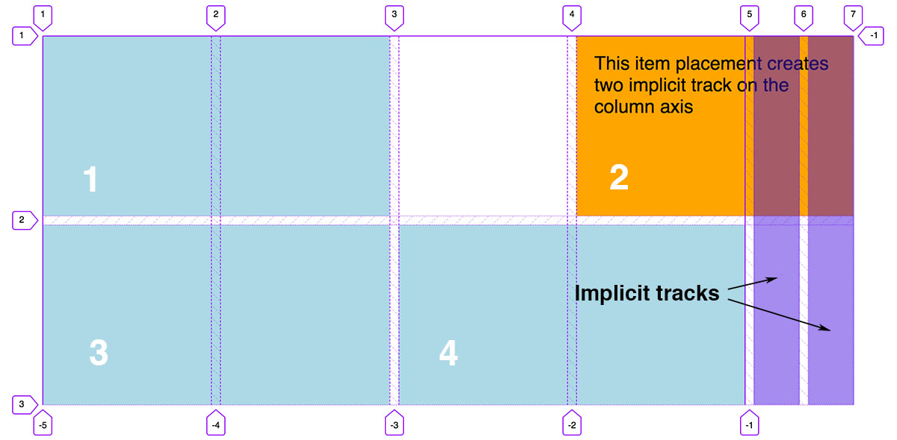
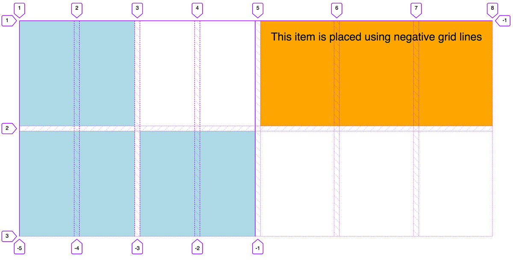
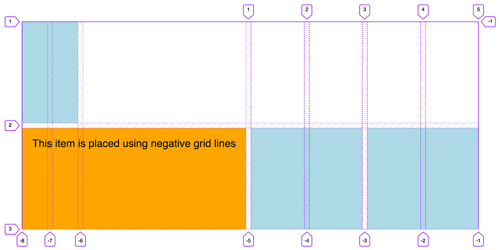

Did you know you can use negative line numbers to position grid items with CSS Grid? I didn’t until recently - or rather, I hadn’t given it any thought, as the situation had never come up for me.

But it stuck me recently, after writing [this article on relative positioning of grid items](/relative-grid-tracks), that negative lines could be advantageous here.

If you place an grid item using a line number with a positive value, if that line doesn’t exist yet (because there aren’t enough tracks in your grid) then _implicit_ tracks will be created.

<figure>
  
  <figcaption>Implicit tracks created on the column axis by placing an item outside of the explicitly defined grid</figcaption>
</figure>

This is useful because we don’t need to define a precise number of tracks if we don’t know how many grid items we’ll be placing. An example might be a news feed or image gallery with dynamic content. We can control the size of these implicit tracks using the [`grid-auto-columns`](https://developer.mozilla.org/en-US/docs/Web/CSS/grid-auto-columns) and [`grid-auto-rows`](https://developer.mozilla.org/en-US/docs/Web/CSS/grid-auto-rows) properties.

What I expected to happen when placing items with negative line numbers was that implicit tracks would be created in the reverse direction - this would be the tracks above the explicitly defined grid tracks on the row axis, or to the left on the column axis (if using the default left-to-right writing mode, which defines the grid content flow). What _actually_ happens is more interesting, and probably a lot more useful.

Imagine I have a grid defined like so, with four explicit tracks on each axis:

```
.grid {
	grid-template-columns: repeat(4, 1fr);
	grid-template-rows: repeat(4, 200px);
}
```

I can place an item like this (using the `grid-column` shorthand property for `grid-column-start` / `grid-column-end`):

```
.item {
	grid-column: -1 / span 3;
}
```

Rather than being starting two grid lines _before_ grid line 1, the item is placed at the very last grid line.

<figure>
  
  <figcaption>Item placed starting at grid line -1, generating implicit tracks</figcaption>
</figure>

In this example I’m using the Grid inspector in Firefox dev tools, which, handily, shows negative grid line numbers as well as positive ones. If I place the item starting at grid-line -2, it will start one grid line from the last one, -3 will be 2 grid lines from last, and so on.

This grid has four tracks, so five grid lines if we ignore any implicit tracks. But we could feasibly place the item using a negative number larger that the ones available, which would create implicit tracks in the other direction:

```
.item {
	grid-column: -8 / span 3;
}
```

<figure>
  
  <figcaption>Item placed starting at grid line -8, generating implicit tracks to the left</figcaption>
</figure>

Note, as we’re creating implicit tracks to the left, the first grid item is now placed at the first implicit track, rather than on the explicit grid. This is because I haven’t explicitly placed the other grid items, so they are being auto-placed into the first available cells.

[Demo here](https://codepen.io/michellebarker/pen/rqGGbJ)

### Why is this useful?

Using negative grid lines allows us to place items relative to the end of the grid. This is especially useful if we have a large grid – it means we don’t have to work out the exact line number from the start, we could simply place it from the end. In a 24 column grid, for example, we might place an item using an end line like this:

```
.item {
	grid-column: span 8 / 24;
}
```

This requires us to remember that the 24th line is one line away from the end. But perhaps the following is a bit more intuitive:

```
.item {
	grid-column: span 8 / -2;
}
```
