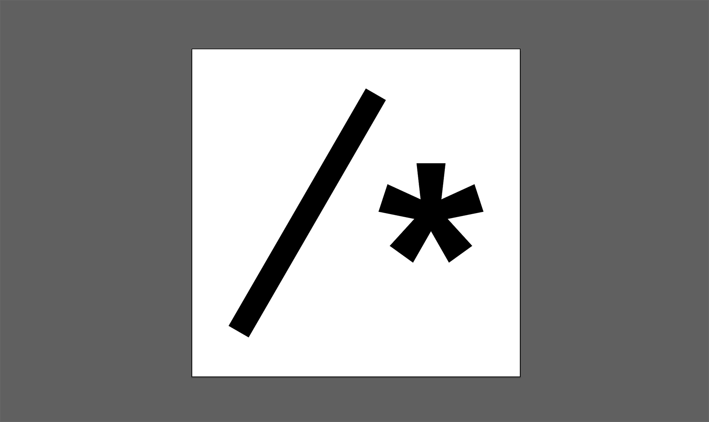
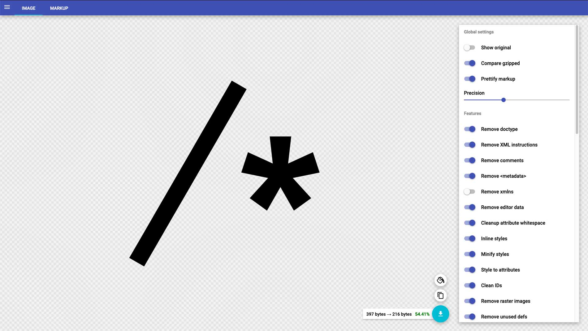
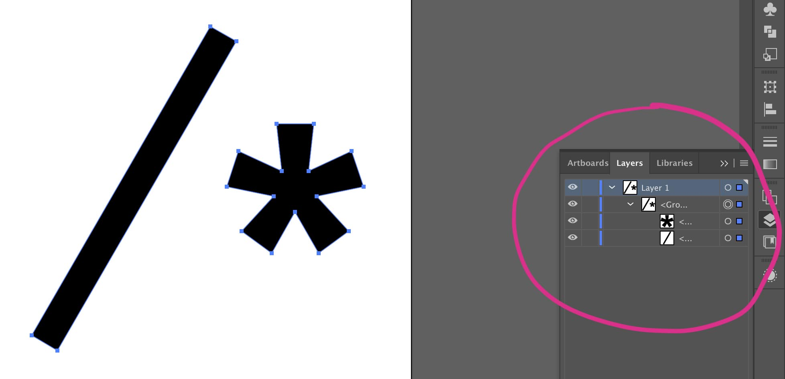
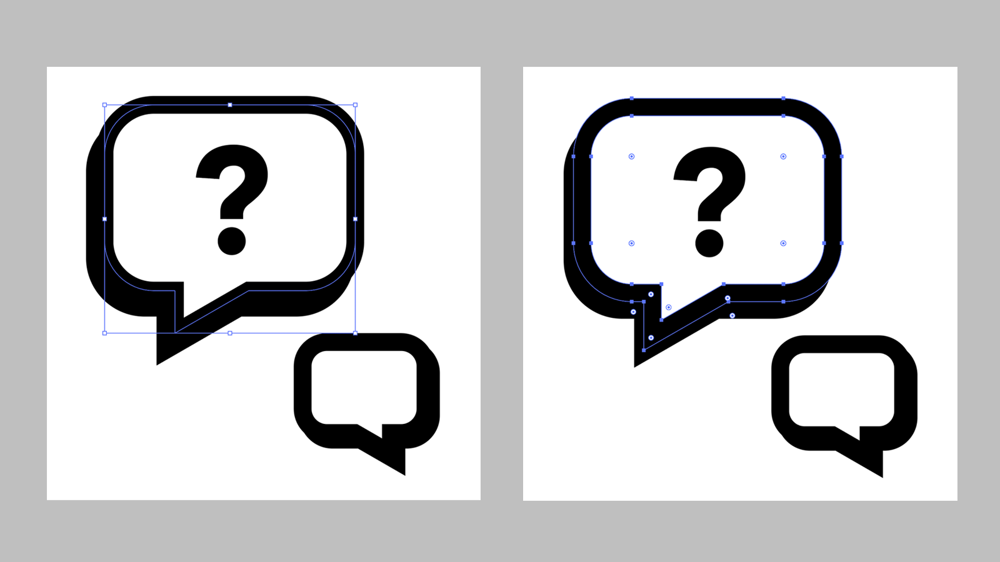

Optimising SVG (scalable vector graphics) for web projects has the dual benefits of reducing the file size _and_ making them easier to work with. But plenty of times I’ve opened up an old web project and found that the SVG code is messy and sub-optimal. In this article I’ll share my process for optimising SVG assets.

Many icon libraries supply SVG assets that are already well-optimised. But if you’re creating your own graphics, or they are supplied by another designer, you might want to run them through a few optimisation steps. I mainly use Adobe Illustrator for creating and editing my SVGs. Here is a fairly simple icon created in Illustrator:

<figure>
  
  <figcaption><em>Fig 01</em></figcaption>
</figure>

We can save this as an SVG in Illustrator. However, if we take a look at the code of our saved SVG, we’ll see that it is quite bloated. The code contains a lot of unnecessary data – groups that could be collapsed, paths that could be merged, metadata created by the program itself, and more:

```xml
<?xml version="1.0" encoding="utf-8"?>
<!-- Generator: Adobe Illustrator 22.1.0, SVG Export Plug-In . SVG Version: 6.00 Build 0)  -->
<svg
  version="1.1"
  id="Layer_1"
  xmlns="http://www.w3.org/2000/svg"
  xmlns:xlink="http://www.w3.org/1999/xlink"
  x="0px"
  y="0px"
  viewBox="0 0 800 800"
  enable-background="new 0 0 800 800"
  xml:space="preserve"
>
  <g>
    <path d="M90,675.6L424,97.1l48.5,28l-334,578.5L90,675.6z" />
    <path
      d="M547.6,279.3h70.2l-10.1,88.2l80.7-37l21.8,66.7l-87.3,17.6l59.9,65.8l-56.4,40.7l-43.8-76.8l-43.8,76.8l-56.4-40.7
		l59.9-65.8L455,397.2l21.8-66.7l80.7,37L547.6,279.3L547.6,279.3z"
    />
  </g>
</svg>
```

Every graphics program will have its own way of saving SVGs, but regardless of which one you use, they are still likely to contain a lot of extra data if left unoptimised.

## Running a package

There are any number of NPM packages that run an optimisation process on your SVG assets at build time, and it’s absolutely a good idea to make them part of your workflow. But a visual tool often does a better job of removing extra paths and groups, and we can see how the optimisations affect the outcome live in the browser.

## A quick win with SVGOMG

One way to quickly remove a lot of this extraneous data is to run it through [Jake Archibald](https://twitter.com/jaffathecake)’s tool, [SVGOMG](https://jakearchibald.github.io/svgomg/). You can either upload the SVG file or paste in the code directly and, depending on the options selected, your SVG will be greatly slimmed-down, without adverse visual impact. You might need to play around with the different options to get your desired result, especially if your SVG is quite complex, but I generally find that for simple icons I can check most of the options without adversly affecting the result.

<figure>
  
  <figcaption><em>Fig 02</em></figcaption>
</figure>

After running it through SVGOMG, the code looks like this:

```xml
<svg xmlns="http://www.w3.org/2000/svg" viewBox="0 0 620.2 606.5">
  <defs/>
  <path d="M0 578.5L334 0l48.5 28-334 578.5-48.5-28zM457.6 182.2h70.2l-10.1 88.2 80.7-37 21.8 66.7-87.3 17.6 59.9 65.8-56.4 40.7-43.8-76.8-43.8 76.8-56.4-40.7 59.9-65.8-87.3-17.6 21.8-66.7 80.7 37-9.9-88.2z"/>
</svg>
```

This is far better than leaving the graphic unoptimised, but it does contain an extranneous `<defs/>` element. And if the original SVG contains groups, layers and effects, then there is a limit to how far a tool like SVGOMG will be able to optimise it. Far better if we go back to our graphics program and make some edits _before_ running it through an optimisation tool.

## Editing the SVG

If you know how to write SVG code, then this is likely to produce the cleanest, leanest result. Check out the MDN docs for a [guide to drawing SVG paths](https://developer.mozilla.org/en-US/docs/Web/SVG/Tutorial/Paths), and [this video](https://www.youtube.com/watch?v=1CDTw_UpQoQ) by [Heydon Pickering](https://twitter.com/heydonworks) if you’re interested in learning more about it.

But for the vast majority of us, editing an SVG is only made practical using a visual tool. For this example I’m using Adobe Illustrator, but others like Sketch have similar editing capabilities.

How much you can edit your SVG depends on its complexity, and its use case. The tips that follow generally apply to icons and simple graphics. Complex illustrations often cannot be edited to such a degree without affecting the end result – and, in some cases, may be better off as PNGs or JPGs.

### Expand groups

The first thing I do when optimising an SVG is remove any hidden layers, and expand groups where possible. This removes any `<g>` tags grouping paths in the SVG code. You might want to keep certain groups intact if you plan to style or animate them. You can expand a group in Illustrator using the shortcut <kbd>Shift</kbd> + <kbd>CMD</kbd> + <kbd>G</kbd>.

<figure>
  
  <figcaption><em>Fig 03</em></figcaption>
</figure>

### Convert to paths

Next I convert any strokes to filled paths, where possible. In Illustrator we can do this using _Object > Expand_. There may be some exceptions: if you’re styling or animating `stroke-dasharray` or `stroke-dashoffset` you’ll need to leave these intact, and likewise if you want to retain the stroke width when scaling the SVG.

<figure>
  
  <figcaption><em>Fig 04</em></figcaption>
</figure>

You can also use the _Expand_ option in Illustrator to convert areas of the image such as simple patterns into individually-selectable paths. For complex or detailed patterns it may be best to avoid this.

### Convert text to outlines

It is sometimes a good idea to convert text to outlines if the text is purely decorative, or the content will be communicated in another way, such as with a heading, button text or `aria-label`. While it is fine to make use of the SVG `<text>` element, it doesn’t always make sense to do so, particularly if you need to load another web font in order to display your SVG text. We can convert text to paths in Illustrator by selecting it and choosing _Type > Convert to outlines_.

### Merge paths

Now that everything in our SVG is a path, we can merge them to ensure as few paths are drawn as possible. Take this example of a “close” icon: the two intersecting paths can be merged into one, resulting in a single path.

To merge paths in Illustrator we select them and use the _merge_ option in the _Pathfinder_ menu.

The exception here is if we want to style or animate any paths individually – in that case we should avoid merging them.

### Delete any extra paths or groups

Once the paths are merged I like to do one final check over the layers and remove any empty layers or duplicate paths that may have been created in the process.

### Fit to artwork bounds

When I use the SVG icon in my HTML I don’t want to be left with extra space around it that I can’t get rid of. This would be the case if the SVG `viewBox` is larger than the contents. In Illustrator, I select _Object > Artboards > Fit to artwork bounds_ to make the `viewBox` dimensions fit the artwork.

### Exporting

Now we’re ready to save the SVG. In Illustrator we can select _File > Save as_ and select SVG as the format. The next screen will give us some options for the SVG. I usually check “Presentation attributes” for the style options.

Once these steps are complete, the SVG is now ready to run through an optimisation tool. For icons, I can usually get away with checking _most_ of the options in SVGOMG, once I’ve run these manual optimisations. You’ll notice the code is much cleaner and leaner! But even this doesn’t always remove everything it’s possible to remove. In the code below I’m still left with an empty `<defs>` element, so it’s worth doing one final manual clean-up and removing that in my code editor. Now the SVG is ready to use!

## Using the SVG

SVGs can be used in a number of ways on the web, including:

- In an `` tag
- In the `background-image` CSS property
- Inline in the HTML

For icons in particular, inline SVGs offer the most in terms of performance and flexibility, and best way to use them generally is to create a [sprite](https://www.webdesignerdepot.com/2017/05/how-to-create-and-manage-svg-sprites/). If you don’t want to do this manually, there are NPM packages available that auto-generate SVG sprites. I’m currently using [this one]() for some projects. Then, when it comes to using them, instead of pasting in the whole SVG, we can reference them with the `<use>` element:

```html
<svg></svg>
```

Because we’re using paths, we can use the following CSS to instruct all SVGs to inherit the current colour, rather than use the `fill` property – which, for an icon system, will help us write less code: An SVG icon used in a button will simply inherit the button’s text colour. (We need to remove the `fill` attribute on the SVG itself in order to style it with CSS.)

```css
svg {
  fill: currentColor;
}
```

## Resources

[Sara Soueidan]() is a well-known authority on all things SVG-related, and has published many, many articles on working with SVG, which you can find [here](https://www.sarasoueidan.com/tags/svg/).
